# Forge

**Framework for Orchestrating Reasoning in Generative Engines**

!!! warning "Early alpha -- everything here is a work in progress"
    This entire project is in very early alpha. The libraries are functional but APIs will change, docs are incomplete, and nothing is production-ready. This site was AI-generated as a starting point and will be properly built out over time. If you're here, you're early. Expect rough edges.

Inference control plane for reasoning-aware open-source models.

The three dominant self-hosting tools -- vLLM, SGLang, Ollama -- are pipes. They move tokens between your application and the inference engine, but none of them have a layer that understands thinking modes, hybrid KV memory profiles, or speculative decoding tradeoffs. Forge builds that layer.

Qwen3.6 is the starting point because it makes these problems explicit (thinking toggling, MTP, linear attention context budgets), but the same patterns show up in Mistral Small 4, GLM-5.1, and DeepSeek V4.

## Architecture

<figure markdown="span">
  { width="100%" }
</figure>

Each layer has a clean contract with the one below it. The session layer calls the context layer for repo ingestion. The optimize layer configures the backends. The compat layer patches backend bugs. The observe layer instruments everything above the backends.

## Install

```bash
pip install forge-infer
```

This pulls in [qwen-think](https://github.com/ArkaD171717/qwen3-Think) and [qwen3.6-mtp](https://github.com/ArkaD171717/Qwen3.6-MTP) as dependencies.

Individual packages are also installable standalone:

```bash
pip install qwen-think        # session management
pip install qwen3.6-mtp       # MTP speculative decoding tuner
pip install qwen3-repo         # repo-to-context ingestion
```

## Quick start

```python
from forge.session import ThinkingSession

session = ThinkingSession(model="Qwen/Qwen3.6-27B")
response = session.chat("Explain merge sort", thinking=True)
```

```python
from forge.mtp import recommend, UseCase, Objective

rec = recommend(
    use_case=UseCase.SINGLE_USER,
    objective=Objective.MINIMIZE_LATENCY,
    gpu_id="rtx-4090",
)
print(rec.enable, rec.expected_gain)
```

See [Getting started](getting-started.md) for more examples and the full layer-by-layer walkthrough.

## Packages

| Package | PyPI | What it does |
|---------|------|-------------|
| [qwen-think](https://github.com/ArkaD171717/qwen3-Think) | `pip install qwen-think` | Thinking-mode session control, backend normalization, context budget |
| [qwen3.6-mtp](https://github.com/ArkaD171717/Qwen3.6-MTP) | `pip install qwen3.6-mtp` | MTP speculative decoding tuner, crossover analysis, config generation |
| [qwen3-repo](https://github.com/ArkaD171717/Qwen3-Repo) | `pip install qwen3-repo` | Dependency-ordered repo ingestion for linear attention models |
| [qwen-compat](https://github.com/ArkaD171717/Qwen3.6-Compat) | -- | Compatibility test matrix and upstream bug fixes |
| [forge-infer](https://github.com/ArkaD171717/Forge-Infer) | `pip install forge-infer` | Metapackage (qwen-think + qwen3.6-mtp) |

## License

Apache 2.0
